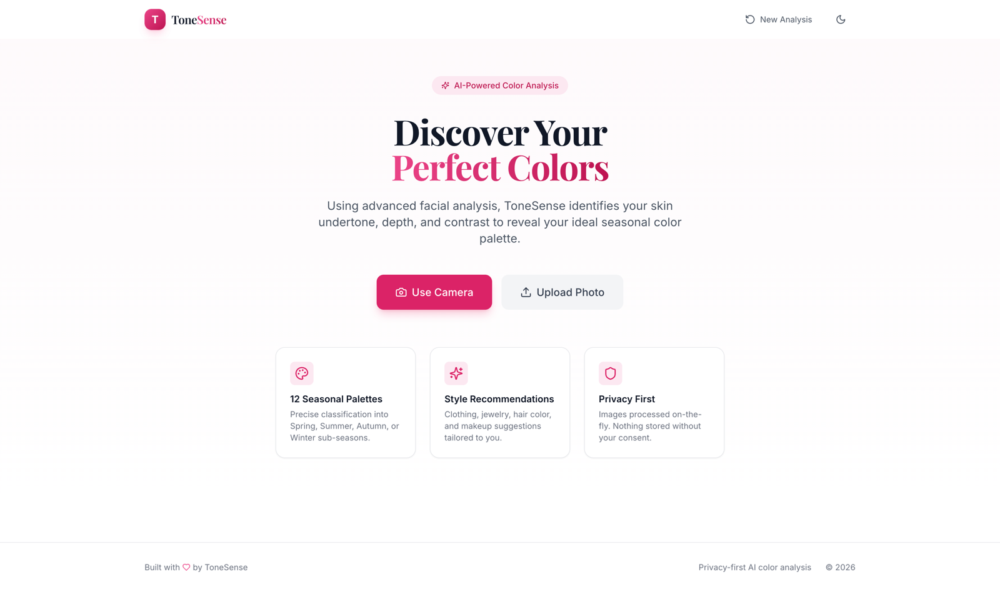
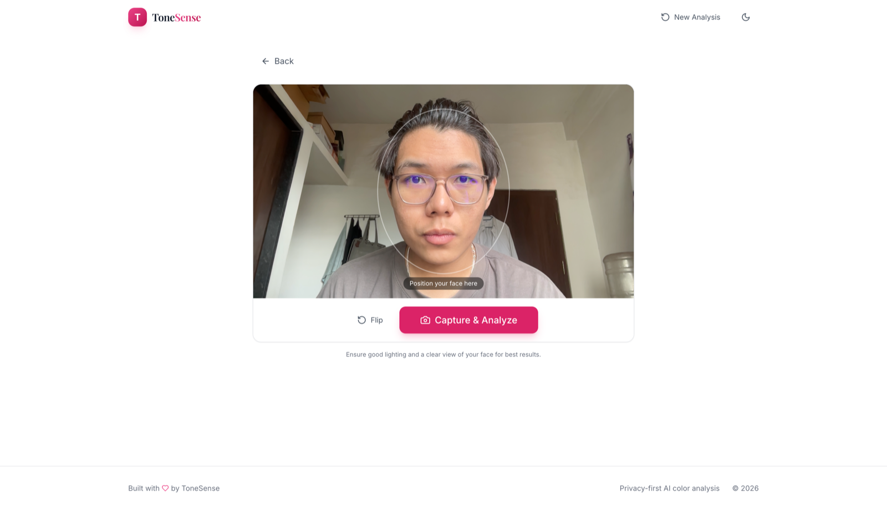
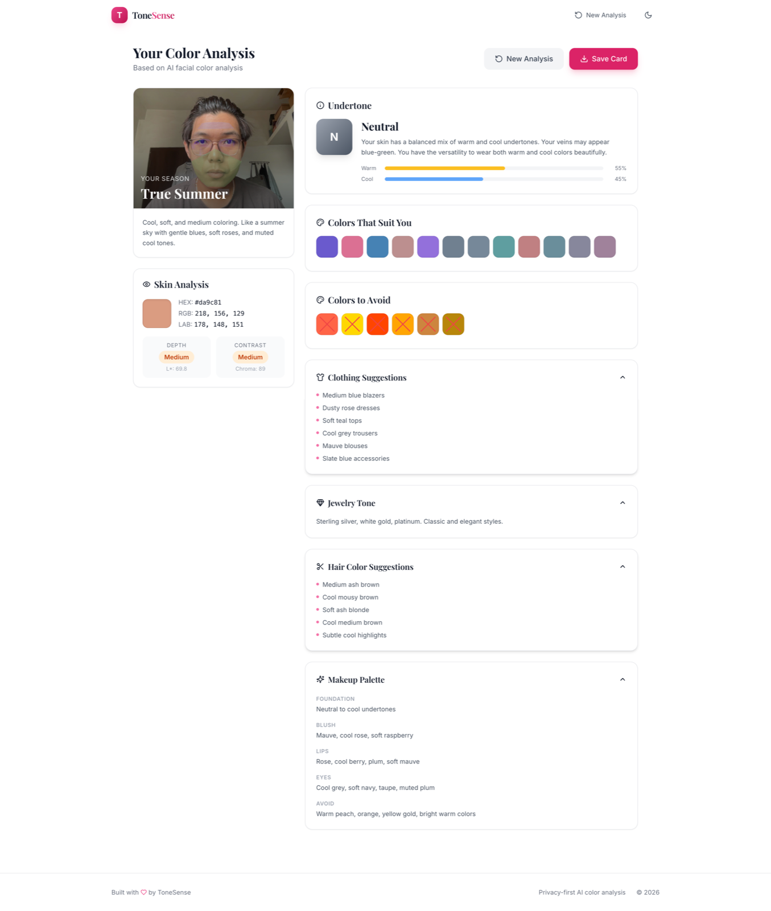
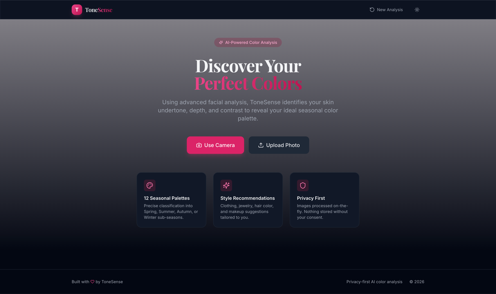

<div align="center">

# 🎨 ToneSense

### Your Personal AI Color Analyst

**Find your season. Wear your colors.** ToneSense scans your face, reads your skin's undertone, depth, and contrast — then hands you the exact palette that makes you glow.

[](https://python.org)
[](https://fastapi.tiangolo.com)
[](https://react.dev)
[](https://tailwindcss.com)
[](https://developers.google.com/mediapipe)
[](LICENSE)
[](https://tonesense.onrender.com)
[](LICENSE)

[Features](#-features) · [How It Works](#-how-it-works) · [Quick Start](#-quick-start) · [API](#-api) · [Deploy](#-deploy-your-own)

**🎯 Try it now: [https://tonesense.onrender.com](https://tonesense.onrender.com)** — no sign-up, runs free-tier, first load may take ~30s while the server wakes up.

</div>

---



Professional color analysis costs **$150–$400 per session** with a stylist. ToneSense gives you a full 12-season analysis in **under 10 seconds** — free, private, from your webcam.

No sign-up. No photo storage. Just point, snap, and discover whether you're a True Summer, Deep Winter, or something in between.

> **🌐 Live at [tonesense.onrender.com](https://tonesense.onrender.com)**

## ✨ Features

| | |
|---|---|
| 📸 **Live Camera or Upload** | Analyze via webcam with a face-alignment guide, or drop in any photo |
| 🧠 **468-Point Face Mesh** | Google MediaPipe maps your face, then samples forehead, cheeks, jawline, and neck — not just one pixel |
| 🔬 **Real Color Science** | RGB → CIELAB conversion, warm/cool undertone scoring, depth (L*) and contrast (chroma) analysis |
| 🍂 **12-Season Classification** | Not just 4 seasons — Light/True/Deep Spring, Light/True/Soft Summer, Soft/True/Deep Autumn, Light/True/Deep Winter |
| 👗 **Complete Style Guide** | Your best colors, colors to avoid, clothing suggestions, jewelry metals, hair colors, and a full makeup palette |
| 💾 **Shareable Result Card** | Export your analysis as a polished PNG — save it, print it, bring it shopping |
| 🌙 **Dark Mode** | Because your colors deserve a beautiful backdrop either way |
| 🔒 **Privacy-First** | Images processed in memory and discarded instantly. Nothing is stored, ever |

## 🖼️ See It In Action

**Live capture with face-alignment overlay**



**Your full analysis — season, palette, and style recommendations**



**Dark mode**



## 🧪 How It Works

```
  Your Photo
      │
      ▼
┌──────────────────┐   MediaPipe Face Landmarker finds 468 facial
│  Face Detection  │   landmarks and locks onto your face
└────────┬─────────┘
         ▼
┌──────────────────┐   Region masks isolate forehead, cheeks,
│  Region Sampling │   jawline, and neck; colors are sampled
└────────┬─────────┘   and averaged per region
         ▼
┌──────────────────┐   RGB → CIELAB. Measure warmth (b*),
│ Color Analysis   │   depth (L*), and contrast (chroma)
└────────┬─────────┘
         ▼
┌──────────────────┐   Undertone × depth × contrast maps to
│ 12-Season Match  │   one of 12 seasonal palettes, plus a
└────────┬─────────┘   full clothing / hair / makeup guide
         ▼
   Your Season ✨
```

## 🚀 Quick Start

**Prerequisites:** Python 3.10+, Node.js 18+

```bash
# 1. Backend
cd backend
python -m venv venv && source venv/bin/activate   # Windows: venv\Scripts\activate
pip install -r requirements.txt
uvicorn main:app --reload --port 8000

# 2. Frontend (new terminal)
cd frontend
npm install
npm run dev
```

Open [http://localhost:5173](http://localhost:5173) — Vite proxies `/api` to the backend.

**One command instead?**

```bash
docker compose up --build
# App: http://localhost:3000 · API docs: http://localhost:8000/docs
```

## 🔌 API

| Method | Endpoint | Description |
|--------|----------|-------------|
| GET | `/api/health` | Health check |
| POST | `/api/analyze` | Analyze an uploaded image (multipart) |
| POST | `/api/analyze-base64` | Analyze a base64 image (JSON) |

<details>
<summary><b>Example response</b></summary>

```json
{
  "success": true,
  "analysis": {
    "skin_color": { "rgb": [198, 168, 140], "lab": [178, 133, 149], "hex": "#c6a88c" },
    "undertone": { "classification": "warm", "warm_score": 0.72, "explanation": "..." },
    "depth": { "level": "medium", "l_value": 69.8 },
    "contrast": { "level": "medium", "chroma": 58 },
    "season": "True Autumn",
    "best_colors": ["#B8860B", "#D2691E"],
    "worst_colors": ["#FF69B4", "#E6E6FA"],
    "clothing_suggestions": ["Olive blazers", "Rust sweaters"],
    "jewelry_tone": "Rich yellow gold, antique gold",
    "hair_color_suggestions": ["Warm chestnut brown", "Caramel highlights"],
    "makeup_palette": { "foundation": "...", "blush": "..." }
  },
  "preview": "data:image/jpeg;base64,..."
}
```

</details>

## 📁 Project Structure

```
ToneSense/
├── backend/
│   ├── analysis/
│   │   ├── face_detection.py     # MediaPipe face mesh + region masks
│   │   ├── color_extraction.py   # Skin sampling & LAB conversion
│   │   ├── tone_classifier.py    # Undertone, depth, contrast
│   │   └── seasonal_palette.py   # 12-season classification + style guide
│   ├── main.py                   # FastAPI server
│   └── requirements.txt
├── frontend/
│   └── src/
│       ├── components/           # React components
│       ├── hooks/                # useDarkMode
│       └── utils/                # API client
├── Dockerfile                    # Single-service build (frontend + backend)
├── docker-compose.yml
└── render.yaml                   # One-click Render deploy
```

## ☁️ Deploy Your Own

**Render (easiest):** Connect this repo, and the included `render.yaml` handles everything — builds the frontend, bundles it into the FastAPI service, and deploys as a single Docker web service. This is exactly how [tonesense.onrender.com](https://tonesense.onrender.com) is deployed — free tier included (server sleeps after 15 min idle; first request takes ~30s to wake).

**Docker anywhere:**

```bash
docker build -t tonesense .
docker run -p 8000:8000 tonesense
```

## 🤝 Contributing

Issues and PRs welcome! Ideas on the roadmap: hair/eye color detection, outfit virtual try-on, palette export to Procreate/Figma.

## 📄 License

[MIT](LICENSE) — free for personal and commercial use.

---

<div align="center">

**Built with ❤️ for everyone who's ever stood in a store wondering "does this color look okay on me?"**

*It does. But now you'll know why.*

</div>
